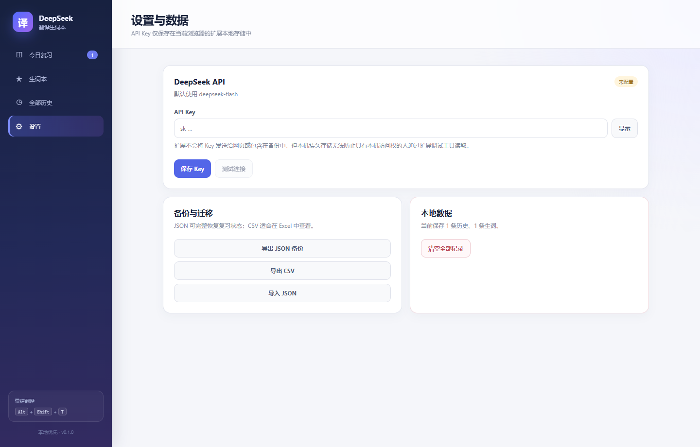

# DeepSeek Edge 划词翻译

一个本地优先的 Microsoft Edge 扩展：在网页上选中英文单词、短语或句子，通过 DeepSeek 翻译成简体中文，并自动保存到生词本进行间隔复习。



## 功能

- 网页划词后显示轻量悬浮按钮，不会因为普通选中操作自动消耗 API。
- 翻译卡顶部支持鼠标拖动，长内容可在卡片内滚动；滚动原网页时卡片保持在用户移动后的位置。
- 单词、短语和句子采用不同的结构化翻译结果。
- 翻译历史自动保存；相同内容使用本地缓存并累计查询次数。
- 一键标记生词，使用“忘记 / 模糊 / 记住”三档间隔复习。
- 保存页面标题、网址和不超过 300 字符的短上下文；这些来源信息不会发送给 DeepSeek。
- 支持搜索、标签、来源回访、JSON 完整备份、JSON 合并恢复和 CSV 导出。
- 支持右键菜单和 `Alt + Shift + T` 快捷键。
- API Key 仅存放在当前浏览器的扩展本地存储中，不会进入导出文件。

## 安装到 Edge

### 方式一：直接加载构建产物

1. 下载本仓库并解压，或使用 Git 克隆。
2. 在项目目录运行：

   ```powershell
   npm install
   npm run build
   ```

3. 在 Edge 地址栏打开 `edge://extensions/`。
4. 打开左侧的“开发人员模式”。
5. 点击“加载解压缩的扩展”，选择项目中的 `.output\edge-mv3` 文件夹。
6. 点击扩展图标，再进入“设置”填写自己的 DeepSeek API Key。

### 获取 DeepSeek API Key

前往 [DeepSeek 开放平台](https://platform.deepseek.com/api_keys) 创建 API Key。Key 通常以 `sk-` 开头，请勿把它粘贴到源码、Issue、截图或 Git 提交中。

配置 Key 后可以先点击“测试连接”。在任意普通网页选中英文，点击选区旁的“翻译”按钮即可使用。

## 使用方式

1. 用鼠标选中 1–2000 个字符的英文文本。
2. 点击选区旁的“翻译”。
3. 查看结构化译文；点击“标记复习”可加入生词本。
4. 点击扩展图标，再点击“打开生词本”进入今日复习、历史或设置。

Edge 内部页面、浏览器商店页、密码框、输入框和在线编辑器不会注入划词界面。受 Edge 安全策略保护的页面无法由普通扩展访问，这是正常现象。

## 本地开发

环境要求：Node.js 20 或更高版本，推荐 Node.js 24。

```powershell
npm install
npm run dev       # 启动 WXT Edge 开发模式
npm run check     # lint + 类型检查 + 测试 + 生产构建
npm run zip       # 生成可分发压缩包
```

主要目录：

```text
entrypoints/background.ts   后台请求、消息路由、右键菜单和快捷键
entrypoints/content.ts      网页划词与 Shadow DOM 浮层
entrypoints/dashboard/      生词本、复习、历史和设置
entrypoints/popup/          扩展图标弹窗
lib/                        DeepSeek、IndexedDB、复习算法和类型协议
tests/                      单元测试、组件测试和导入样例
```

## 数据与隐私

- 扩展只把当前选中的英文文本发送给 `https://api.deepseek.com`。
- 网页标题、URL、周边上下文、历史、标签和复习状态只保存在本机。
- API Key 使用 `chrome.storage.local` 持久保存，并限制为受信任扩展上下文访问。
- 本机持久存储无法防止拥有本机访问权的人通过扩展调试工具读取 Key；不要在共享或不可信电脑上保存 Key。
- 所有模型输出以纯文本渲染，不执行模型返回的 HTML 或脚本。

完整说明见 [PRIVACY.md](PRIVACY.md)。

## 技术栈

- [WXT](https://wxt.dev/) + Manifest V3
- React + TypeScript
- Dexie / IndexedDB
- Zod 结构校验
- Vitest + Testing Library
- DeepSeek Responses API（默认模型 `deepseek-flash`）

## 验证状态

- ESLint、TypeScript、15 个单元/组件测试和 WXT 生产构建通过。
- 已使用 Microsoft Edge 152 真实加载 `.output\edge-mv3`，验证划词浮层、无 Key 引导、导入导出、搜索、标签、复习调度和弹窗统计。
- 实际翻译请求需要用户自行配置有效 DeepSeek API Key；自动测试使用模拟响应，不包含任何真实凭据。

## 许可证

[MIT](LICENSE)
